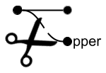
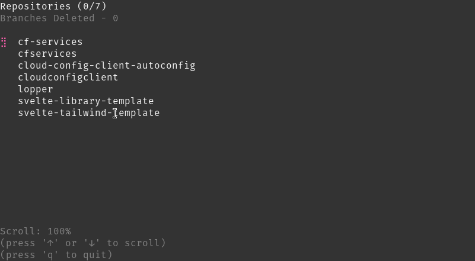

# Lopper



[](https://github.com/Piszmog/lopper/actions/workflows/ci.yml)
[](https://img.shields.io/github/v/release/Piszmog/lopper)
[](https://opensource.org/licenses/MIT)

Lopper is a tool that deletes local Git branches that have been merged into the main remote branch.



## What does it do?

Lopper will,

1. Check if there are any uncommitted changes.
2. Checks out the main branch.
3. The main branch is updated (pulled)
4. Lopper retrieves the list of local branches that have been merged into the main branch.
5. Lopper deletes the local branches these branches.

See the `Usage` section for more details on modifying the behaviour of Lopper.

## Installation

Head over to [Releases](https://github.com/Piszmog/lopper/releases) and download the artifact for your architecture.

## Usage

```shell
$ ./lopper -p /path/to/repo/or/directory/of/repos 
```

### Options

| Option                 | Default | Required  | Description                                                          |
|:-----------------------|:-------:|:---------:|:---------------------------------------------------------------------|
| `--path`, `-p`         |   N/A   | **True**  | The path to the repository or directory of repositories              |
| `--protected-branches` |   N/A   | **False** | The branches other than `main` and `master` to protect from deletion |
| `--concurrency`, `-c`  |   `1`   | **False** | The number of repositories to process in parallel                    |
| `--dry-run`            | `false` | **False** | Run `lopper` without actually deleting any branches                  |
| `--help`, `-h`         | `false` | **False** | Shows help                                                           |

### Commands

| Command     | Description                                      |
|:------------|:-------------------------------------------------|
| `help`, `h` | Shows a list of commands or help for one command |
